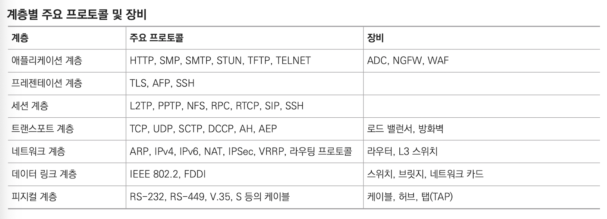

# 1.4 OSI 7계층별 이해하기

## 1.4.1. 1계층 (피지컬 계층)

- 물리 계층, **물리적 연결**과 관련된 정보를 정의한다.
- 주로 **전기 신호를 전달**하는 데 초점
- 주요 장비: 허브, 리피터, 케이블, 커넥터, 트랜시버, 탭
    - 허브, 리피터: 네트워크 통신을 중재하는 네트워크 장비
    - 케이블, 커넥터: 케이블 본체를 구성하는 요소
    - 트랜시버: 컴퓨터의 랜카드와 케이블을 연결하는 장비
    - 탭: 네트워크 모니터링과 패킷 분석을 위해 전기 신호를 다른 장비로 복제
- 1계층은 **들어온 전기 신호를 그대로 잘 전달하는 것이 목적**이므로 전기 신호가 1계층 장비에 들어오면 이 전기 신호를 재생성해서 내보낸다.
- **주소 개념이 없어서**, 전기 신호가 들어온 포트를 제외하고 모든 포트에 같은 전기 신호를 전송한다.

## 1.4.2. 2계층 (데이터 링크 계층)

- 데이터 링크 계층, 전기 신호를 모아 우리가 알아볼 수 있는 **데이터 형태로 처리**한다.
- 주소 정보를 정의하고 정확한 주소로 통신이 되도록 하는 데 초점
- 2계층은 주소 체계가 생기면서 여러 통신이 한꺼번에 이루어지는 것을 구분하기 위한 기능이 주로 정의된다.
- 주소 체계가 생긴다는 의미는 한 명과 통신하는 것이 아니라 **동시에 여러 명과 통신**할 수 있다는 것이므로, 무작정 데이터를 던지는 것이 아니라 **받는 사람이 현재 데이터를 받을 수 있는지 확인하는 작업**이 필요하다. 이 역할을 **플로 컨트롤(flow control)** 이라고 한다.

- 2계층에서 동작하는 네트워크 구성 요소: 네트워크 인터페이스 카드, 스위치
    - 둘 다 MAC 주소를 이해할 수 있고, 스위치는 MAC 주소를 보고 통신해야할 포트를 지정해 내보내는 능력이 있다.
- **2계층 가장 중요한 특징: MAC 주소**

> 참고: 네트워크 인터페이스 카드를 부르는 방법
> 
> 
> 네트워크 인터페이스 카드 or 네트워크 인터페이스 컨트롤러 → NIC
> 
> 네트워크 카드
> 
> 랜 카드
> 
> 물리 네트워크 인터페이스 (Physical Network Interface)
> 
> 이더넷 카드
> 
> 네트워크 어댑터
> 

### 네트워크 인터페이스 카드 동작 방식

1. 전기 신호를 데이터 형태로 만든다.
2. 목적지 MAC 주소와 출발지 MAC 주소를 확인한다.
3. 네트워크 인터페이스 카드의 MAC 주소를 확인한다.
4. 목적지 MAC 주소와 네트워크 인터페이스 카드가 갖고 있는 MAC 주소가 맞으면 데이터를 처리하고(상위 계층에서 처리할 수 있도록 메모리에 적재), 다르면 데이터를 폐기한다.

### 스위치

단말(Terminal)이 어떤 MAC 주소인지, 연결된 포트는 어느 것인지 주소 습득(Address Learning) 과정에서 알 수 있다.

이 데이터를 기반으로 단말들이 통신할 때 **포트를 적절히 필터링하고 정확한 포트로 포워딩**해준다.

스위치에 적절한 **필터링**과 **포워딩** 기능으로 통신이 필요한 포트만 사용하고 불필요한 처리가 감소함으로 이더넷 네트워크 효율성이 크게 향상되었고, 이더넷 기반 네트워크가 급증하는 계기가 되었다.

## 3계층 (네트워크 계층)

- **IP주소와 같은 논리적인 주소가 정의**된다.
- 데이터 통신에는 2가지 주소가 사용되는데, 2계층의 물리적인 MAC 주소와 3계층의 논리적인 IP주소이다.
- MAC 주소와 달리 IP 주소는 사용자가 환경에 맞게 변경해 사용할 수 있고, 네트워크 주소 부분과 호스트 주소 부분으로 나뉜다.
- 3계층 장비/단말은 네트워크 주소 정보를 이용해 자신이 속한 네트워크와 원격지 네트워크를 구분할 수 있고 원격지 네트워크를 가려면 어디로 가야하는지 **경로를 지정하는 능력**이 있다.
- 3계층 장비: 라우터
    - IP 주소를 사용해 최적의 경로를 찾아주고, 해당 경로로 패킷을 전송하는 역할을 한다.

## 1.4.4. 4계층 (트랜스포트 계층)

- **1,2,3 계층**은 신호와 데이터를 올바른 위치로 보내고 **실제 신호를 잘 만들어 보내는데 집중**한다.
- **4계층은** 해당 데이터들이 **정상적으로 잘 보내지도록 확인하는 역할**을 한다.
- 패킷 네트워크는 데이터를 분할해 패킷에 실어 보내다 보니, 중간에 패킷이 유실되거나 순서가 바뀌는 경우가 생길 수 있다.
- 이 문제를 해결하기 위해 **패킷이 유실되거나 순서가 바뀌었을 때 바로잡아주는 역할**을 **4계층**에서 담당한다.
    - 4계층에서 패킷을 분할할 때 패킷 헤더에 보내는 순서와 받는 순서를 적어 통신
    - 시퀀스 번호 Seqeunce Number: 패킷에 보내는 순서 명시
    - ACK 번호 Acknowledgement Number: 패킷에 받는 순서 명시
    - 포트 번호: 상위 애플리케이션 구분하기 위한 번호

## 1.4.5. 5계층 (세션 계층)

- 우리가 부르는 “세션 관리”를 세션 계층에서 한다. (TCP/IP 만들고 없애는 책임)
    - 양 끝단의 응용 프로세스가 **연결을 성립**하도록 도와준다.
    - 연결이 안정적으로 **유지**되도록 **관리**한다.
    - 작업 완료 이후에는 이 연결을 **끊는** 역할을 한다.
- 에러로 중단된 통신에 대해 **에러 복구**와 **재전송**을 수행한다.

## 1.4.6. 6계층 (프레젠테이션 계층)

- 표현 방식이 다른 애플리케이션이나 시스템 간의 통신을 돕기 위해 하나의 통일도니 구문 형식으로 변환시키는 기능을 수행한다. (일종의 번역기/변환기 역할)
- 인코딩, 암호화, 압축, 코드 변환과 같은 동작이 이루어진다.

## 1.4.7. 7계층 (애플리케이션 계층)

- 애플리케이션 프로세스를 정의하고, 애플리케이션 서비스를 수행한다.
- 네트워크 소프트웨어 UI 부분, 사용자의 입/출력 부분을 정의한다.
- 대표적인 프로토콜: FTP, SMTP, HTTP, TELNET

### 계층별 주요 프로토콜 및 장비
