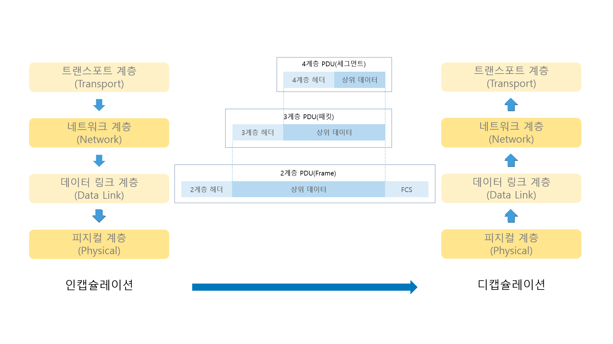

## 1.5 인캡슐레이션과 디캡슐레이션

상위 계층에서 하위 계층으로 데이터를 보내면 물리 계층에서 전기 신호 형태로 네트워크를 통해 신호를 보낸다.
받는 쪽에서는 다시 하위 계층에서 상위 계층으로 데이터를 보낸다.

이처럼 데이터를 보내는 과정을 인캡슐레이션(encapsulation), 받는 과정을 디캡슐레이션(decapsulation)

현대 네트워크는 대부분 **패킷** 기반이다.\
패킷 네트워크는 데이터를 **패킷이라는 작은 단위로 쪼개 보내**는데 이런 기법으로 하나의 통신이 회선 전체를 점유하지 않고 동시에 여러 단말이 통신하도록 해준다.\
데이터를 패킷으로 쪼개고 네트워크를 이용해 목적지로 보내고 받는 쪽에서는 패킷을 다시 큰 데이터 형태로 결합해 사용한다.

### 인캡슐레이션
- 애플리케이션에서 데이터를 데이터 플로 계층(1~4 계층)으로 내려보내면서 패킷에 데이터를 넣을 수 있도록 분할
1. 네트워크 상황을 고려해 적절한 크기로 데이터를 쪼개고
2. 4계층부터 네트워크 전송을 위한 정보를 헤더에 붙여 넣는다.\
   이때 헤더 정보는 차례로 4, 3, 2계층에서 각 자신이 필요한 정보를 추가하는데, 이 정보는 **비트 단위**로 쓰여진다.\
   마지막 2계층에서는 헤더 정보를 추가한 후 전기신호로 변환해 수신자에게 전송하게 된다.

### 디캡슐레이션
1. 받은 전기 신호를 데이터 형태로 만들어 2계층으로 올려보낸다.
2. 2계층에서는 송신자가 작성한 2계층 헤더에 포함된 정보를 확인한다.\
   만약 정보 중 **목적지 정보가 자신이 아니라면 패킷을 버린다.**\
   앞서 OSI 7계층의 2계층에서 다루었던 LAN 카드가 이 역할을 한다. 
3. 이어서 차례로 3, 4계층에서도 패킷을 받아 헤더 정보를 확인한다.

위와 같이
- 인캡슐레이션, 디캡슐레이션 과정을 거쳐 데이터가 전송
- 각 계층 헤더를 이용해 송-수신자 계층 간의 논리적 통신이 가능

함을 알 수 있습니다.

정리하자면 실제 데이터는
- 송신자: **상위 계층 -> 하위 계층**으로 순서로 계층별로 헤더가 붙어 **인캡슐레이션** 되어 전달되고,
- 수신자: **하위 계층 -> 상위 계층**으로 순서로 계층별로 헤더를 확인하고 벗겨내어 **디캡슐레이션** 되어 전달됩니다.

### 인/디캡슐레이션 과정의 헤더 정보

캡슐레이션 시에 사용되는 헤더는
1. 현재 계층에서 정의하는 정보\
   OSI 7계층의 각 계층에서의 목적에 맞는 정보들이 포함된다.\
   **4계층의 목적은 큰 데이터를 잘 분할하고 받는 쪽에서 잘 조립하는 것!!**\
   따라서 받은 패킷의 순서, 빠진 패킷은 없는지 등 **패킷 점검 역할**이 중요하다.\

|     | 패킷 정보                                          |
|-----|------------------------------------------------|
| 4계층 | 시퀀스(sequence), 에크(ACKnowledgement) 번호 필드로 표현   |
|3계층| 3계층에서 정의하는 논리적인 주소인 출발지, 도착지 IP 주소       |
|2계층| MAC 주소를 정의하는데, 3계층처럼 2계층도 출발지, 도착지 MAC 주소 |

2. 상위 프로토콜 지시자
   프로토콜 스택은 상위 계층으로 올라갈 수록 종류가 많아진다.\
   3계층 프로토콜인 IP는 4계층에서는 다시 TCP와 UDP로 나뉘고 그보다 더 상위 계층에서는 FTP, HTTP, SMTP, POP3 등 더 다양한 프로토콜로 다시 나뉜다.\
   인캡슐레이션은 상위 프로토콜이 많아도 문제가 되지 않지만 **디캡슐레이션하는 수신자 쪽에서는 헤더에 아무 정보가 없으면 어떤 상위 프로토콜로 올려보낼지를 결정할 수 없다.**\
   이런 문제를 방지하기 위해 인캡슐레이션 하는 쪽에서는 헤더에 **상위 프로토콜 지시자 정보를 포함**해야 한다.
   - 4계층: 포트 번호
   - 3계층: 프로토콜 번호
   - 2계층: 이더 타입

   알아두어야 할 것은 포트 번호는 4계층 헤더에 적힌 정보이지만, 애플리케이션 계층에서 프로토콜 종류를 나타내는 정보라는 것이다.\
   즉, 디캡슐레이션할 때 상위 프로토콜 지시자 정보를 이용해 어느 상위 계층 프로토콜로 보내야할 지 구분하는 것이므로 **동작하는 계층보다 한 계층 위의 정보가 적혀있게 된다.**

데이터를 반드시 포함해야한다.

